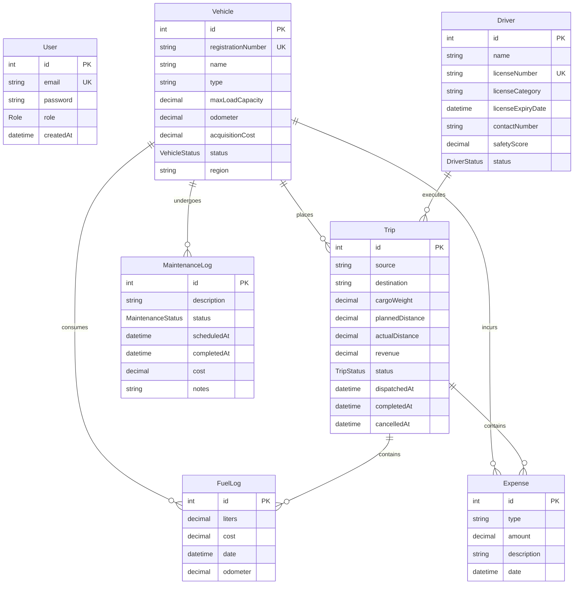

# 🚛 TransitOps — Smart Transport Operations Platform

TransitOps is a centralized fleet and transport operations management platform. It coordinates the complete lifecycle of logistic tasks—spanning from vehicle registry and driver compliance to dispatch execution, maintenance scheduling, fuel logging, and dynamic return-on-investment (ROI) analytics.

---

## 🏗️ System Architecture

TransitOps is designed around a multi-layered service-oriented architecture ensuring separation of concerns, high throughput, and reliable transactional integrity.


### Architecture Highlights:
- **Client App**: Responsive web interface styled dynamically with custom themes (supporting system/dark modes).
- **Authentication & RBAC**: Stateless authentication layer leveraging **JSON Web Tokens (JWT)**. Validates and authorizes incoming requests based on specific user roles:
  - `FLEET_MANAGER`
  - `DRIVER`
  - `SAFETY_OFFICER`
  - `FINANCIAL_ANALYST`
- **API & Service Layer**: Next.js route handlers map requests to robust domain services (Vehicle, Driver, Trip, Maintenance, and Reporting services).
- **Redis Caching**: Highly optimized read path utilizing **Upstash Redis** to cache vehicle and trip lists. Mutations trigger write-through cache invalidation.
- **ORM & Database**: **Prisma ORM** provides type-safe database queries to a **PostgreSQL** relational database.

---

## ⚡ Caching Strategy (Upstash Redis)

To reduce latency and database load, the platform utilizes a cache-aside pattern on list queries:
- **Keys**: List queries are cached under structured keys: `vehicles:list:<filters>` and `trips:list:<filters>`.
- **TTL**: Cached results expire automatically after **5 minutes (300 seconds)**.
- **Smart Invalidation**: Creating, updating, or deleting records invokes cache clearing actions. For instance:
  - Any vehicle modification fetches keys matching `vehicles:list:*` and issues a `redis.del(...keys)` command.
  - Any trip change invalidates both `trips:list:*` and `vehicles:list:*` keys to maintain immediate dashboard alignment.

---

## 📊 Database Schema Details

The PostgreSQL relational database manages the following core entities:



---

## 🚀 Getting Started

Follow these steps to configure and run the project locally.

### 1. Prerequisites
- **Node.js**: `v18.x` or higher
- **PostgreSQL**: A running instance (local or hosted e.g. Neon.tech)
- **Upstash Redis**: A Redis database instance

### 2. Configure Environment Variables
Create a `.env` file in the root directory:
```bash
# PostgreSQL Database connection string
DATABASE_URL="postgresql://<USER>:<PASSWORD>@<HOST>/<DATABASE>?sslmode=require"

# JWT Auth Secrets
JWT_SECRET="your-development-jwt-secret-string"
JWT_SECRET_KEY="your-encryption-key-for-jose-encryption"

# Upstash Redis Configuration
UPSTASH_REDIS_REST_URL="https://your-redis-instance.upstash.io"
UPSTASH_REDIS_REST_TOKEN="your-redis-auth-token"
```

### 3. Install Dependencies
```bash
npm install
```

### 4. Database Setup & Prisma Generation
Configure your database and build the Prisma client mapping:
```bash
# Push schema changes to the PostgreSQL database
npx prisma db push

# Generate the type-safe Prisma client
npx prisma generate
```

### 5. Running the Application
Start the development server:
```bash
npm run dev
```
Open [http://localhost:3000](http://localhost:3000) to view the application console.

---

## 📦 Deployment

When deploying to platforms like Vercel, the Prisma client must be generated dynamically during the build pipeline. The application has this setup out of the box in the `build` script of `package.json`:

```json
"scripts": {
  "build": "prisma generate && next build"
}
```

This guarantees the generated types are created before the Next.js production compiler triggers.
